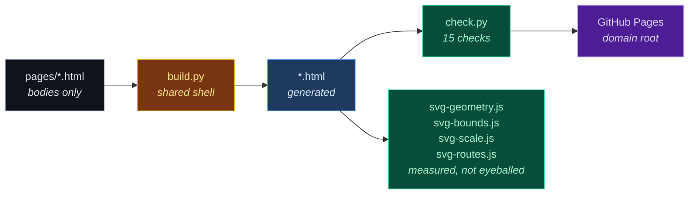

<div align="center">


**The public site.** Eight static pages plus a 404, no framework, no bundler, no `node_modules`.

[](https://doublegate-io.github.io)
[](#build)
[](#what-checkpy-enforces)
[](#build)

</div>

---

## Build

```bash
python3 build.py           # regenerate *.html from pages/*.html
python3 build.py --check   # fail if output is stale (CI does this)
python3 check.py           # fifteen gate checks
node    svg-geometry.js    # SVG text nodes must not collide      (needs a browser)
node    svg-bounds.js      # ...nor run outside their viewBox     (needs a browser)
node    svg-scale.js       # ...nor scale under 10px in the page  (needs a browser)
node    svg-routes.js      # no connector may run through a box   (pure geometry)
```

`*.html` at the root is **generated**. Edit `pages/*.html` and rebuild — a change made
directly to a built page is lost on the next build.



## Layout

| Path | Purpose |
|---|---|
| `pages/*.html` | page bodies — `<section>` content only, no `<head>` or nav |
| `build.py` | shared shell, site map, per-page titles and meta descriptions |
| `check.py` | gate checks; exits non-zero on any failure |
| `robots.txt`, `sitemap.xml`, `404.html` | **generated** by `build.py` from `NAV`, so a new page cannot be missing from them |
| `svg-geometry.js` | text nodes must not overlap each other, in every SVG asset |
| `svg-bounds.js` | text must not extend past the viewBox — the overlap check cannot see this |
| `svg-scale.js` | the smallest label in every embedded figure must render ≥10px at 1280/900/390px |
| `svg-routes.js` | no visible connector may be routed through a box interior — pure path/rect geometry, no browser |
| `assets/style.css` | one stylesheet for all eight pages |
| `assets/logo.svg` | brand mark, themed — favicon (follows the tab strip) |
| `assets/logo-dark.svg` | brand mark, forced dark — nav (site is always dark) |
| `assets/wordmark.svg` | mark + name + tagline, for README embedding |
| `assets/social-card.svg` | 1200×630 link-preview card (`og:image`) |
| `assets/hero-flow.svg` | wide animated flow diagram, front page |
| `assets/artifact-flow.svg` | tall walkthrough diagram, how-it-works |
| `assets/scope-flow.svg` | the four scopes and where each trust boundary sits, commons |
| `assets/cost-flow.svg` | one correction with and without a gate, for-organizations |
| `assets/record-fields.svg` | what a signed record holds, field by requirement, governance |
| `assets/favicon-32.png` | PNG favicon fallback, light-tab colours baked in |
| `assets/apple-touch-icon.png` | 180×180 iOS home-screen icon, dark ground + padding |
| `AGENTS.md` | working agreement: copy craft, positioning, claim limits |

## The eight pages

Each has exactly one reader and one job.

| Page | Reader | Job |
|---|---|---|
| `index` | anyone, 60 seconds | hook, diagram, four guarantees, route them onward |
| `how-it-works` | curious evaluator | the five stages, and what happens when each fails |
| `for-organizations` | budget holder | the measured business case |
| `for-engineers` | whoever will run it | interface, costs, dependencies, what is unfinished |
| `governance` | auditor, compliance | connectors, the four properties, requirement mapping |
| `commons` | contributor, sceptic | the public library, and why no registry does this today |
| `pricing` | buyer | four scopes, and why the boundaries sit where they do |
| `evidence` | sceptic | every claim with its primary source, including the awkward ones |

## What check.py enforces

Every check exists because the failure happened at least once. That is the whole design
principle: **turn each found incoherence into an assertion**, because a class of error
that was possible once recurs during the next rewrite.

| # | Check | The failure that created it |
|---|---|---|
| 1 | Tag balance | an unclosed `<div>` silently swallows the rest of a page |
| 2 | In-page anchors resolve | a `#target` with no matching `id` |
| 3 | Cross-page links resolve | eight pages cross-link heavily; a rename broke one silently |
| 4 | Assets exist | a typo'd `src` renders as a broken image |
| 5 | No internal vocabulary | a visitor meeting a component ID learns the page was not written for them |
| 6 | Head metadata present | two pages shared a link preview and neither was findable |
| 7 | Every page has a call to action | a dead-end page is a lost reader |
| 8 | Images carry real alt text | the diagram carries the argument; `alt=""` drops it |
| 9 | `og:image`/`og:url` absolute | crawlers do not resolve relative Open Graph URLs — the preview silently had no image while the page rendered fine |
| 10 | No links into the private design repo | the design package is private; a deep link 404s and a reader cannot tell that from evidence not existing |
| 11 | Nav parity + label/heading agreement | four of six nav labels once disagreed with the heading they scrolled to |
| 12 | SVG motion paths resolve | an `mpath` pointing at a missing id animates to nowhere |
| 13 | README inline HTML well-formed | a string replacement dropped an `` open tag; invisible in review |
| 14 | No orphaned sentence fragments | stripping private-repo links left two captions as fragments — "…you do not own." then "a deliberate decision, not an oversight" — and they shipped |
| 15 | Every evidence claim has a resolvable source | the evidence page promised "sourced or marked unverified", then carried a claim whose source line said "with the citation above" and pointed at nothing |

## Design notes

Colour carries meaning consistently across the diagrams, the CSS and the brand mark:

| Meaning | Colour |
|---|---|
| held / quarantined | `#fb7185` red |
| scanned / checking | `#fbbf24` amber |
| graded / signed / safe | `#34d399` green |
| countersigned / ledger | `#a78bfa` violet |
| readable / distributed | `#22d3ee` cyan |
| records / evidence | `#60a5fa` blue |

**The brand mark is the product in one glyph:** two offset rounded rectangles — two
entries in a register, the second sitting over the first, so nothing joins the collection
until both exist. Its geometry was measured rather than eyeballed. In a 32-unit viewBox
the rects are 13×20 at rx 2, offset 6px, stroke-width 2.5, which resolves as **four
distinct stroke crossings** on the centre scanline at 32px — verified by reading the
rasterized canvas, not by looking at it.

**One constant colour, one partner per ground.** No two fixed colours clear 3:1 contrast
on both black and white, so `#2563eb` is the constant (3.85:1 on the dark page, 5.17:1 on
white) and its partner switches: ink `#e6e9ef` on dark, granat `#0A1F44` on light. The
themed `logo.svg` does that switch in a media query; `logo-dark.svg` is a forced-dark copy
for the nav, because a nav `` resolves `prefers-color-scheme` from the OS rather than
from the always-dark page it sits on. The PNG fallbacks bake one ground each, since a PNG
cannot carry a query.

Twelve rounds failed that measurement before this one — four posts read as a barcode at
favicon size, a wider bar left only 1.6px, and every "gate" reading turned into a diagram
that needed explaining. Worth recording: **a vision read of the rendered PNGs called
versions unacceptable that were provably clean, and passed ones that clipped.** It caught
a social card whose tagline measured 1214px in a 1200px viewBox, and it was wrong about
pixel gaps it could not resolve. Both directions argue for the same discipline — measure.

Both flow diagrams are self-contained SVG: no JavaScript, no external fonts, no build
step. Animation is SMIL, which degrades to a static diagram where unsupported. Motion
tracks run on a rail *below* the boxes — an earlier version sent animated dots through the
labels, legible in a still and unreadable in motion.

**The hero and the walkthrough must use the same words for the same stage.** They
did not. The hero called the organization gate `COUNTERSIGNED` and drew it as one box;
the walkthrough called it `REVIEWED → SCORED → VALIDATED → RECORDED` and never used
the word "countersigned" at all — which appeared nowhere in the prose either. A reader
who learned the front page met different stage names one click later. The hero now uses
the walkthrough's own framing (`THE SECOND GATE — reviews it again, on its own
authority`), because the walkthrough is the one that matches the copy. No gate catches
this class of defect: `svg-geometry.js` passed both files cleanly the whole time, since
nothing overlapped and nothing overflowed. It is a story bug, and it needs reading.

**Green means signed, and only signed.** Zone 3 of the walkthrough (`YOU`, `YOUR
GROUP`) was green, which made four different things green — two signature stages and
two audience stages. Those boxes answer *who can read it*, so they now take cyan, which
already means "readable / distributed" in the same vocabulary. Green is left to `SIGNED`
and `VALIDATED`.

**A connector must route around a box, and only geometry can prove it does.**
Separating those three crowded attachments moved the author fast lane from x=640 to
x=648 — which is *inside* the `THE SECOND GATE` box (x 632..772). The dashed line and
its animated dot climbed vertically through 78px of that box's interior, and it
shipped. Every existing check passed it: `svg-geometry.js` compares text nodes to each
other, `svg-bounds.js` compares text to the viewBox, `svg-scale.js` measures rendered
font size. A path crossing a rect involves no text at all, so none of them could see
it. The fast lane now climbs the 24px corridor between `GRADED & SIGNED` (…608) and
`THE SECOND GATE` (632…) at x=620 — the only vertical route out of the rail after
signing that crosses nothing, and semantically the right one, since the author's copy
becomes readable the moment signing completes and before the second gate. `svg-routes.js`
flattens every visible path and tests it against every leaf box, so this cannot recur.
Confirmed in pixels either way: at y=118 the branch sat at x=647 before and sits at
x=619 now.

**A branch needs a marked origin, not just a correct one.** Three routes left the hero's
rail within the 152px under `GRADED & SIGNED` — the stage dot at x=532, the author fast
lane at x=560, the rejection at x=596. All three were geometrically right and visually
unreadable: an independent read of the render traced the up-branch to the wrong box.
They are now 124px apart, direction carries meaning (rejection arcs back left, the fast
lane climbs forward right), and the rejection's departure carries its own ringed dot
like every other junction on the rail.

**Both diagrams honour `prefers-reduced-motion`.** Every animated element sits inside a
`.mover` group the media query hides, so a reader who asks the OS for less motion gets the
static figure — which still carries the whole argument. Verified by rendering the SVG twice
under headless Chrome with and without `--force-prefers-reduced-motion` and counting dot
pixels on the rails: 168 with motion, 38 without (the 38 are the static stage terminals).

**Narrow screens do not shrink the diagrams.** Scaling a 1080px figure into a 674px column
renders its smallest label at 7.2px. Below 900px the figure keeps a legible 1000px width
and scrolls horizontally instead.

**The container decides legibility, so the container is measured too.** A figure can pass
the overlap and bounds checks and still be unreadable on the page: `cost-flow.svg` was
dropped into a `.wrap tight` section (max-width 900px), scaled to 0.783, and rendered its
11.5px labels at **9.0px** — under the floor this stylesheet commits to, and invisible to
every gate that measures an SVG in isolation. `svg-scale.js` now walks every built page at
1280/900/390px, reads each figure's smallest declared `font-size`, multiplies by the
rendered scale, and fails under 10px. Wide figures belong in a full `.wrap`, not the tight
prose wrap.

## Related

The design package — requirements, architecture, decision records, cited research — is a
separate **private** repository. Nothing here links into it; every public claim cites its
primary source directly instead.

<div align="center">

[**doublegate-io**](https://github.com/doublegate-io) · [**the live site**](https://doublegate-io.github.io)

</div>
