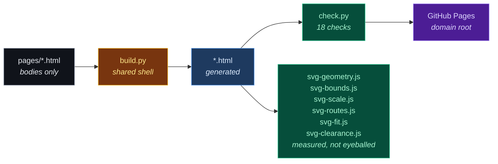

<div align="center">


**The public site.** Eight static pages plus a 404, no framework, no bundler, no `node_modules`.

[](https://doublegate-io.github.io)
[](#build)
[](#what-checkpy-enforces)
[](#build)

</div>

---

## Build

```bash
python3 build.py           # regenerate *.html from pages/*.html
python3 build.py --check   # fail if output is stale (CI does this)
python3 check.py           # eighteen gate checks
python3 sky-data.py        # regenerate assets/sky-data.js from sky-claims.txt (check.py runs --check)
node    svg-geometry.js    # SVG text nodes must not collide      (needs a browser)
node    svg-bounds.js      # ...nor run outside their viewBox     (needs a browser)
node    svg-scale.js       # ...nor scale under 10px in the page  (needs a browser)
node    svg-routes.js      # no connector may run through a box   (pure geometry)
node    svg-fit.js         # ...and every label fits its own box   (needs a browser)
node    svg-clearance.js   # ...and no line crowds a label         (needs a browser)
python3 hero-field.py      # regenerate the front-page field figure (seeded, deterministic)
```

`*.html` at the root is **generated**. Edit `pages/*.html` and rebuild — a change made
directly to a built page is lost on the next build.



## Layout

| Path | Purpose |
|---|---|
| `pages/*.html` | page bodies — `<section>` content only, no `<head>` or nav |
| `build.py` | shared shell, site map, per-page titles and meta descriptions |
| `check.py` | gate checks; exits non-zero on any failure |
| `robots.txt`, `sitemap.xml`, `404.html` | **generated** by `build.py` from `NAV`, so a new page cannot be missing from them |
| `svg-geometry.js` | text nodes must not overlap each other, in every SVG asset |
| `svg-bounds.js` | text must not extend past the viewBox — the overlap check cannot see this |
| `svg-scale.js` | the smallest label in every embedded figure must render ≥10px at 1280/900/390px |
| `svg-routes.js` | no visible connector may be routed through a box interior — pure path/rect geometry, no browser |
| `svg-fit.js` | every label must fit inside the box that contains it, with 8px clear on each side |
| `svg-clearance.js` | no stroked line may pass within 6px of any label's rendered box |
| `check.py` 7b | a button label names its destination — it may not argue for the click, price it, or tell the reader they are wrong |
| `assets/style.css` | one stylesheet for all eight pages |
| `assets/logo.svg` | brand mark, themed — favicon (follows the tab strip) |
| `assets/logo-dark.svg` | brand mark, forced dark — nav (site is always dark) |
| `assets/wordmark.svg` | mark + name + tagline, for README embedding |
| `assets/social-card.svg` | 1200×630 link-preview card (`og:image`) |
| `sky-claims.txt` | the knowledge map's 800 claims: 20 subjects × 40, one line each, plain text so a reviewer reads them as copy |
| `sky-data.py` | validates `sky-claims.txt` (counts, relations, vocabulary and phase gates, no duplicates) and generates `assets/sky-data.js` |
| `assets/sky.js` | the knowledge map: canvas 2D, no dependencies — constellations, arrivals, five verdicts, turn / zoom / dive |
| `assets/hero-field.svg` | five verdicts over sixty submissions, still figure — the front page's no-JavaScript fallback for the map |
| `assets/artifact-flow.svg` | tall walkthrough diagram, how-it-works |
| `assets/scope-flow.svg` | the four scopes and where each trust boundary sits, commons |
| `assets/cost-flow.svg` | one correction with and without a gate, for-organizations |
| `assets/record-fields.svg` | what a signed record holds, field by requirement, governance |
| `assets/favicon-32.png` | PNG favicon fallback, light-tab colours baked in |
| `assets/apple-touch-icon.png` | 180×180 iOS home-screen icon, dark ground + padding |
| `AGENTS.md` | working agreement: copy craft, positioning, claim limits |

## The eight pages

Each has exactly one reader and one job.

| Page | Reader | Job |
|---|---|---|
| `index` | anyone, 60 seconds | hook, the live knowledge map, four guarantees, route them onward |
| `how-it-works` | curious evaluator | the five stages, and what happens when each fails |
| `for-organizations` | budget holder | the measured business case |
| `for-engineers` | whoever will run it | interface, costs, dependencies, what is unfinished |
| `governance` | auditor, compliance | connectors, the four properties, requirement mapping |
| `commons` | contributor, sceptic | the public library, and why no registry does this today |
| `pricing` | buyer | four scopes, and why the boundaries sit where they do |
| `evidence` | sceptic | every claim with its primary source, including the awkward ones |

## What check.py enforces

Every check exists because the failure happened at least once. That is the whole design
principle: **turn each found incoherence into an assertion**, because a class of error
that was possible once recurs during the next rewrite.

| # | Check | The failure that created it |
|---|---|---|
| 1 | Tag balance | an unclosed `<div>` silently swallows the rest of a page |
| 2 | In-page anchors resolve | a `#target` with no matching `id` |
| 3 | Cross-page links resolve | eight pages cross-link heavily; a rename broke one silently |
| 4 | Assets exist | a typo'd `src` renders as a broken image |
| 5 | No internal vocabulary | a visitor meeting a component ID learns the page was not written for them |
| 6 | Head metadata present | two pages shared a link preview and neither was findable |
| 7 | Every page has a call to action | a dead-end page is a lost reader |
| 8 | Images carry real alt text | the diagram carries the argument; `alt=""` drops it |
| 9 | `og:image`/`og:url` absolute | crawlers do not resolve relative Open Graph URLs — the preview silently had no image while the page rendered fine |
| 10 | No links into the private design repo | the design package is private; a deep link 404s and a reader cannot tell that from evidence not existing |
| 11 | Nav parity + label/heading agreement | four of six nav labels once disagreed with the heading they scrolled to |
| 12 | SVG motion paths resolve | an `mpath` pointing at a missing id animates to nowhere |
| 13 | README inline HTML well-formed | a string replacement dropped an `` open tag; invisible in review |
| 14 | No orphaned sentence fragments | stripping private-repo links left two captions as fragments — "…you do not own." then "a deliberate decision, not an oversight" — and they shipped |
| 15 | Every evidence claim has a resolvable source | the evidence page promised "sourced or marked unverified", then carried a claim whose source line said "with the citation above" and pointed at nothing |
| 16 | One contact address, reachable from every page | the readiness review found no way to reach anyone; a product site with no contact path is a brochure |
| 17 | No phase language, defensive framing or disclaimer headings in visible copy | an offering audit carried the design repo's engineering-tier honesty list onto three pages as copy ("no design yet — scheduled, not drawn") and every other gate stayed green |
| 18 | Knowledge-map scripts exist and ship from `assets/`, the generated data is fresh, every claim passes the copy gates, and the page carries every element `sky.js` writes to | the map is the site's first JavaScript; its 800 claims are visible copy that lives in a `.js` file where gate 5 does not look, and a renamed element id fails silently in a browser |

## The knowledge map (front page)

The section under the hero is a canvas: twenty constellations, one per subject an
organization's agents learn about, each star one claim a reviewer signed. Claims arrive
continually and one of the five verdicts happens to each -- the same five, in the same
five colours, as the still figure that used to sit there and now serves as its
`<noscript>` fallback.

**Why a sky and not a graph.** The site's argument is scale (five hundred agents) and
inheritance (what one learns, all inherit). A force-directed graph of 800 nodes says
"complexity". A sky says "a body of knowledge with shape": constellations are subjects,
the faint long lines are subjects that bear on each other, and a new star landing in the
right place is the whole product in one gesture. The reader does not need to decode it.

**What is real and what is illustrative, stated on the page.** The 800 claims are
written (`sky-claims.txt`, 20 x 40, each one a sentence a reviewer would recognise as a
real thing agents learn); which arrives next, and when, is random. The verdict mix
follows the still figure's illustrative split (23 / 14 / 11 / 8 / 4), and the page says
it is not a measured rate. Arrivals are Poisson-ish -- exponential inter-arrival, mean
2.1 s, one in eight a burst -- because a metronome reads as a demo and a queue reads as
a system. When every claim has arrived once, superseded and refused claims come round
again as "the same lesson learned by another agent", so the stream never stops.

**Layout is seeded; arrivals are not.** Category centres come from a small 3D force
layout (repulsion, springs on the relation edges, a squash on y so the sky is a disc,
then a separation pass so no two constellations overlap), seeded so every visitor sees
the same sky. Star positions inside a constellation are seeded on the claim id, with a
minimum gap so a new star never lands on an old one. The only per-visit randomness is
the arrival order and the verdicts.

**Zoom is magnification, not travel.** The camera does not move through the stars --
`Z` scales the projection, and pan is in screen pixels. So a constellation at 6x is the
same shape as at 1x, only readable; point size grows as `Z^0.72` and line width a little,
so the picture gets denser with detail rather than just bigger. Wheel zooms at the
pointer; double-click or double-tap dives 3x into the constellation under the point and
centres it; a second dive past 70% of the maximum returns to the whole sky; `+ - 0`
and the buttons do the same from the keyboard. Double-tap is detected from pointer
events, not the `dblclick` event, because a canvas with `touch-action: none` gets no
`dblclick` on most mobile browsers -- found in headless testing, where the event never
fired at all.

**Labels are the hard part.** A constellation's name sits above its top star, nearest
constellation first, and a name is dropped when it would overlap an already-placed name
or sit over another constellation's stars (three tolerated on desktop, one on a phone,
six when zoomed in past 2x -- at that point the stars are the reader's own subject). A
dropped name is better than a name over the wrong stars; names come back as you zoom.

**No dependencies, no build.** Canvas 2D, 800 points, a few hundred segments, one
`requestAnimationFrame` loop that only redraws when something is animating or the
view changed. Measured 60 fps on desktop and on a 390px viewport in headless Chrome.
Colours are read from `style.css` custom properties at start, so the five verdicts cannot
drift from the rest of the site. Reduced-motion: arrivals land without flight, the idle
turn stops, the live dot does not pulse, tweens are instant.

**Editing the claims.** Edit `sky-claims.txt`, run `python3 sky-data.py`, commit both.
`check.py` gate 18 runs `sky-data.py --check` and fails on a stale data file, a category
with the wrong count, a relation to a category that does not exist, a duplicate claim, a
claim that starts with a capital (they are fragments), or a claim that would fail the
vocabulary or phase-language gates -- the claims are copy, and a claim in a tooltip is
as visible as a heading.

## Design notes

Colour carries meaning consistently across the diagrams, the CSS and the brand mark:

| Meaning | Colour |
|---|---|
| held / quarantined | `#fb7185` red |
| scanned / checking | `#fbbf24` amber |
| graded / signed / safe | `#34d399` green |
| countersigned / ledger | `#a78bfa` violet |
| readable / distributed | `#22d3ee` cyan |
| records / evidence | `#60a5fa` blue |

**The brand mark is the product in one glyph:** two offset rounded rectangles — two
entries in a register, the second sitting over the first, so nothing joins the collection
until both exist. Its geometry was measured rather than eyeballed. In a 32-unit viewBox
the rects are 13×20 at rx 2, offset 6px, stroke-width 2.5, which resolves as **four
distinct stroke crossings** on the centre scanline at 32px — verified by reading the
rasterized canvas, not by looking at it.

**One constant colour, one partner per ground.** No two fixed colours clear 3:1 contrast
on both black and white, so `#2563eb` is the constant (3.85:1 on the dark page, 5.17:1 on
white) and its partner switches: ink `#e6e9ef` on dark, granat `#0A1F44` on light. The
themed `logo.svg` does that switch in a media query; `logo-dark.svg` is a forced-dark copy
for the nav, because a nav `` resolves `prefers-color-scheme` from the OS rather than
from the always-dark page it sits on. The PNG fallbacks bake one ground each, since a PNG
cannot carry a query.

Twelve rounds failed that measurement before this one — four posts read as a barcode at
favicon size, a wider bar left only 1.6px, and every "gate" reading turned into a diagram
that needed explaining. Worth recording: **a vision read of the rendered PNGs called
versions unacceptable that were provably clean, and passed ones that clipped.** It caught
a social card whose tagline measured 1214px in a 1200px viewBox, and it was wrong about
pixel gaps it could not resolve. Both directions argue for the same discipline — measure.

Both flow diagrams are self-contained SVG: no JavaScript, no external fonts, no build
step. Animation is SMIL, which degrades to a static diagram where unsupported. Motion
tracks run on a rail *below* the boxes — an earlier version sent animated dots through the
labels, legible in a still and unreadable in motion.

**The hero and the walkthrough must use the same words for the same stage.** They
did not. The hero called the organization gate `COUNTERSIGNED` and drew it as one box;
the walkthrough called it `REVIEWED → SCORED → VALIDATED → RECORDED` and never used
the word "countersigned" at all — which appeared nowhere in the prose either. A reader
who learned the front page met different stage names one click later. The hero now uses
the walkthrough's own framing (`THE SECOND GATE — reviews it again, on its own
authority`), because the walkthrough is the one that matches the copy. No gate catches
this class of defect: `svg-geometry.js` passed both files cleanly the whole time, since
nothing overlapped and nothing overflowed. It is a story bug, and it needs reading.

**Green means signed, and only signed.** Zone 3 of the walkthrough (`YOU`, `YOUR
GROUP`) was green, which made four different things green — two signature stages and
two audience stages. Those boxes answer *who can read it*, so they now take cyan, which
already means "readable / distributed" in the same vocabulary. Green is left to `SIGNED`
and `VALIDATED`.

**A two-panel figure argued for pooling, which needs no product.** The field figure
started as silo-versus-share, and share is what every memory provider already sells --
a reader who knows the category saw "one writes, 499 inherit" and thought "so, mem0".
The site's own copy has the missing panel in it: *"one wrong memory would reach
everyone, and nobody could say who vouched for it"*, and *"across fourteen providers a
write is retrievable immediately; scores change ranking, never visibility."* So the
figure is three panels now -- **siloed, pooled, gated** -- and the middle one is the
naive fix visibly failing, with the wrong memory travelling at exactly the speed of the
right one. Panel 3 is that same speed with the mistake stopped. The argument stops being
"pool your knowledge" and becomes the site's actual one: the risk of pooling is what the
gate removes, and removing it is what makes the knowledge worth collecting.

Contagion is the one thing a dot field carries for free, and it needs no connectors --
just colour. Which produced the trap: panel 1 was red for "taught alone" while panel 2
was red for "carrying a mistake", one colour with two meanings sitting side by side.
That is the same defect class as the 500-meaning-two-units bug from the round before,
reintroduced one panel over. Panel 1 is slate now; nothing is *wrong* there, its cost is
waste. Red appears exactly once, so its absence in panel 3 reads as "the red is gone".
Row pitch went 7.4 to 8.6 for the narrower column, because at 25 rows the dots merged
into vertical stripes and the field read as 20 bars rather than 500 individuals -- and
the individual is the unit the whole argument is counted in.

Two review notes I declined, recorded because declining them was the judgement: making
panel 3's single author dot louder (the numeral beside it says 1, and 499 teal dots
*are* the inheritance -- a louder dot would have the picture contradict its own count),
and rewording the footer's "whether what moves is worth having", which is the thesis and
the only line not restating a panel.

**Two figures were drawing the same idea, and the smaller one was the front door.**
The index headline argues a population: "Your company is paying to teach five hundred
private AI agents." The figure under it drew a pipeline -- the sequence one claim
passes through -- which is what `artifact-flow.svg` already draws on how-it-works, in
full, with 44 labels to the hero's 25. So the front page spent its best slot on an
abridged version of the next page, and answered a claim about scale with a claim about
order. Four rail layouts were generated and measured before anyone noticed that; the
staleness was never the routing, it was the subject.

`hero-field.svg` draws the five hundred instead. Two fields of 500 dots, one dot per
agent: on the left every one lit, taught separately, 500 agents taught; on the right one
lit and 499 inheriting, 1 agent taught. The count is the argument, so the count is what
the reader sees -- and can check by looking, which is the point of using the real number
rather than a suggestive smear of dots.

Two things it fixes structurally. The numerals count the same unit the field counts:
the first draft paired a 500 meaning *lessons bought* with 500 dots meaning *agents*,
and the unit only resolved from the footer -- a decode delay in the one place a reader
grants none. And there are three strokes in the whole figure against the rail version's
eleven, so the entire class of defect from the last three commits (a lane through a box,
a lane re-entering the box it left, a caption under a bracket) has almost nothing left
to act on. Clearance measures 28px, the loosest figure on the site.

`svg-clearance.js` grew one narrow exemption for it: a leader line under 26px that ends
on the label it points at may touch that label, because touching is its entire job.
Verified narrow, not blind -- it still catches both defects it originally found, the
old hero's 5px and cost-flow's 2px, when those are put back.

**When a connector needs to dodge something, the layout is wrong, not the
connector.** Three commits in a row patched the hero figure's author fast lane:
reroute it away from a box, then re-centre its callout, then jog it to reach the
callout again. Each edit was locally right and they composed into nonsense -- the
lane left the GRADED & SIGNED box, curved right, climbed, ran back left and
re-entered the same box it started from. Right, up, left, up, for a branch whose
whole meaning is "this stage, immediately".

The lesson is that a single horizontal rail with three kinds of branch hanging off
it gives a branch nowhere to go but around, and "around" means curves, and curves
have to weave between labels. So the figure is now GENERATED (`hero-variants.py`)
from one geometry source under two rules that the old one broke: a branch leaves
and enters at a JUNCTION -- the dot on a stage centre line, never an arbitrary
point inside a box -- and connectors are orthogonal, straight runs with a small
corner radius, never quadratics threading past text.

Four layouts were built and measured rather than argued about: a banded rail, a
two-column vertical spine, a three-lane version with no branches at all, and a
rail-less chain of edge-to-edge boxes. The banded rail won on numbers -- tightest
line-to-label clearance 9px against the old figure's 5px, 436px tall so it stays a
glance where the two-column version needs 795px and becomes a scroll. Curvature
fell from 8.5% of sampled connector length to 3.5%, and that remainder is just the
two rounded corners of the rejection bracket.

`svg-clearance.js` is the gate: no stroked line may pass within 6px of any label's
rendered box. It reproduces the 5px violation in the old figure, and it found a
third asset with the same defect that nobody had reported -- a `cost-flow.svg`
caption sitting 2px above a box border. Worth recording that I first "fixed" that
by excluding it as a false positive; it was real, and the reflex to explain away
an inconvenient true positive is the more dangerous bug.

**A label must fit the box that holds it, and only measurement knows.** The hero
figure looked cheap and the reason was mechanical, not aesthetic: eleven labels were
wider than the boxes drawn around them. "READABLE COMPANY-WIDE" was 198px of text in a
180px box, so it bled 9px past the border on both sides; every one of the six stages
overflowed somewhere. Box widths had been picked by hand (104, 128, 128, 152, 140, 180)
and the copy was written afterwards, so nothing ever reconciled the two.

The four existing SVG checks all passed it, because none of them asks this question.
`svg-geometry.js` compares text to other text, `svg-bounds.js` compares text to the
viewBox, `svg-scale.js` compares rendered size to a legibility floor, `svg-routes.js`
compares paths to rects. An overflowing label is on-canvas, legible, and not touching
another label, so the suite reported the file clean while it looked like a draft.

The row is now generated from measured text: each box is its widest label plus 13px
padding a side, the 24px leftover is distributed evenly so the row spans exactly
24…1056, and the copy was cut where the measurement demanded it ("your agent cannot
read it" → "no read path to it", "THE SECOND GATE" → "SECOND GATE", "READABLE
COMPANY-WIDE" split across two lines). `svg-fit.js` is the gate — 169 labels across 9
assets, every one fitting with 8px clear. It caught two more the moment it existed: the
author callout was hand-sized at 200px around 254px of text.

One warning for later, learned twice in one sitting. Vision review found the overflow
but then invented two defects that were not there — it reported the callout as
off-centre (it is centred to 0.5px) and the two dashed lanes as crossing (closest
approach, by `getPointAtLength` sampling at 800 points each: **140.72px**). A
hue-based pixel detector I wrote to settle it also returned false positives, because it
cannot tell a dashed connector from a box border. Measure with the geometry, not with
an eye and not with a quick detector.

**A button label is a signpost, not an argument.** The primary CTA on the landing
page read *"Why this costs you money"*. It scolds the reader in the second person and
offers a cost as the reward for clicking — and it sat directly under a headline that
already opens with what the reader is losing, so the first two things a visitor saw
were both accusations. Worse, it was one of three different editorial labels pointing
at the *same* page: `how-it-works` called it "Why it is worth running", `evidence`
called it "What this means for your company". One destination, three names, none of
them the page's name. All three now read "The business case", which is what
`governance` and `pricing` already called it. Two headings went the same way ("What it
costs you" → "What it costs"; "So why doesn't everyone pool it already?" → "Why nobody
pools it today"), and the evidence route card dropped *"If you think this is hype"* —
putting an objection in the reader's mouth and then arguing with it. `check.py` 7b
holds the line: a label may say what a thing is, not whether it is worth it, what it
costs the reader, or why they are wrong.

**A connector must route around a box, and only geometry can prove it does.**
Separating those three crowded attachments moved the author fast lane from x=640 to
x=648 — which is *inside* the `THE SECOND GATE` box (x 632..772). The dashed line and
its animated dot climbed vertically through 78px of that box's interior, and it
shipped. Every existing check passed it: `svg-geometry.js` compares text nodes to each
other, `svg-bounds.js` compares text to the viewBox, `svg-scale.js` measures rendered
font size. A path crossing a rect involves no text at all, so none of them could see
it. The fast lane now climbs the 24px corridor between `GRADED & SIGNED` (…608) and
`THE SECOND GATE` (632…) at x=620 — the only vertical route out of the rail after
signing that crosses nothing, and semantically the right one, since the author's copy
becomes readable the moment signing completes and before the second gate. `svg-routes.js`
flattens every visible path and tests it against every leaf box, so this cannot recur.
Confirmed in pixels either way: at y=118 the branch sat at x=647 before and sits at
x=619 now.

**A branch needs a marked origin, not just a correct one.** Three routes left the hero's
rail within the 152px under `GRADED & SIGNED` — the stage dot at x=532, the author fast
lane at x=560, the rejection at x=596. All three were geometrically right and visually
unreadable: an independent read of the render traced the up-branch to the wrong box.
They are now 124px apart, direction carries meaning (rejection arcs back left, the fast
lane climbs forward right), and the rejection's departure carries its own ringed dot
like every other junction on the rail.

**Both diagrams honour `prefers-reduced-motion`.** Every animated element sits inside a
`.mover` group the media query hides, so a reader who asks the OS for less motion gets the
static figure — which still carries the whole argument. Verified by rendering the SVG twice
under headless Chrome with and without `--force-prefers-reduced-motion` and counting dot
pixels on the rails: 168 with motion, 38 without (the 38 are the static stage terminals).

**Narrow screens do not shrink the diagrams.** Scaling a 1080px figure into a 674px column
renders its smallest label at 7.2px. Below 900px the figure keeps a legible 1000px width
and scrolls horizontally instead.

**The container decides legibility, so the container is measured too.** A figure can pass
the overlap and bounds checks and still be unreadable on the page: `cost-flow.svg` was
dropped into a `.wrap tight` section (max-width 900px), scaled to 0.783, and rendered its
11.5px labels at **9.0px** — under the floor this stylesheet commits to, and invisible to
every gate that measures an SVG in isolation. `svg-scale.js` now walks every built page at
1280/900/390px, reads each figure's smallest declared `font-size`, multiplies by the
rendered scale, and fails under 10px. Wide figures belong in a full `.wrap`, not the tight
prose wrap.

## Related

The design package — requirements, architecture, decision records, cited research — is a
separate **private** repository. Nothing here links into it; every public claim cites its
primary source directly instead.

<div align="center">

[**doublegate-io**](https://github.com/doublegate-io) · [**the live site**](https://doublegate-io.github.io)

</div>
